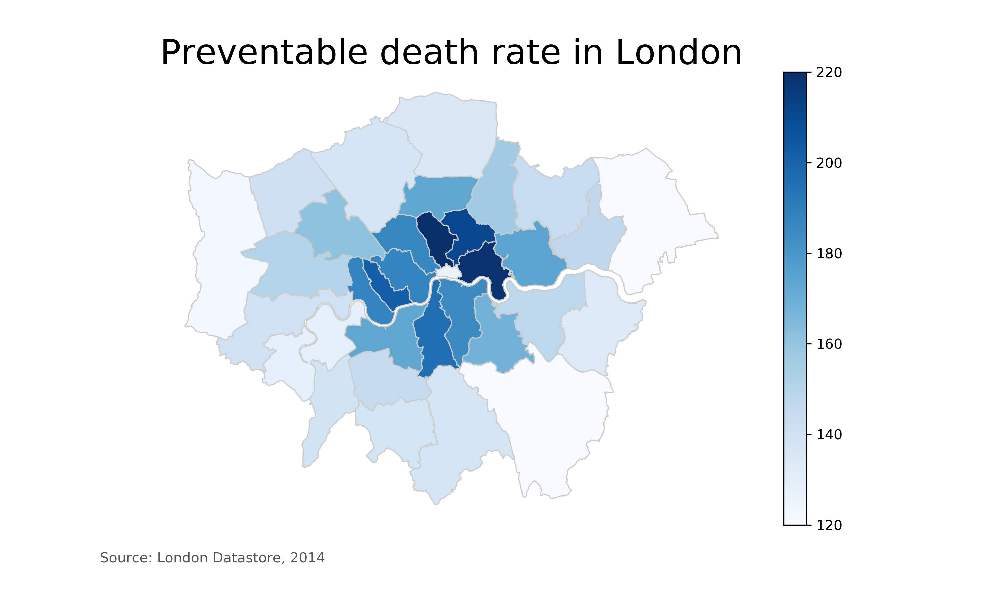

# Let's make a map! Using Geopandas and Matplotlib in Python

JK downloaded this repo from 
https://github.com/bendoesdata/make-a-map-geopandas.
To reproduce the results from the tutorial, it was necessary copy the files from 
https://github.com/maczokni/crimeMapTest
into the data directory.

JK tried this, but it didn't work:
SHAPE_RESTORE_SHX=YES fio info London_Borough_Excluding_MHW.shp 

So you want to make a map using Python. Let's get started!

This is a tutorial on how to make a choropleth map using Geopandas and Matplotlib in Python. The full write-up tutorial is <a href="https://medium.com/@bendoesdata/lets-make-a-map-using-geopandas-pandas-and-matplotlib-to-make-a-chloropleth-map-dddc31c1983d" target="_blank">here on Medium</a>. By the end of this walk through (or by simply downloading the repo and running the code), you'll be able to make a publisher-ready map like this using Python and Geopandas.

